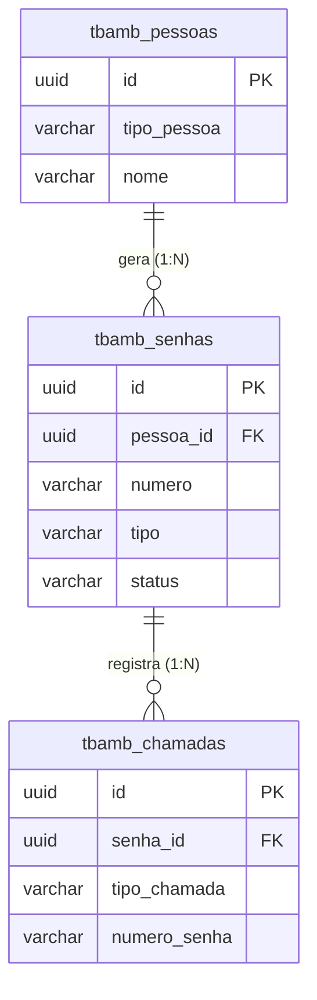
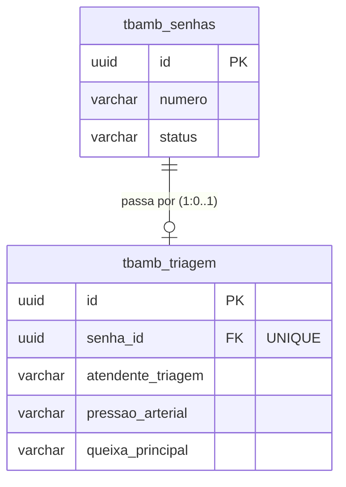
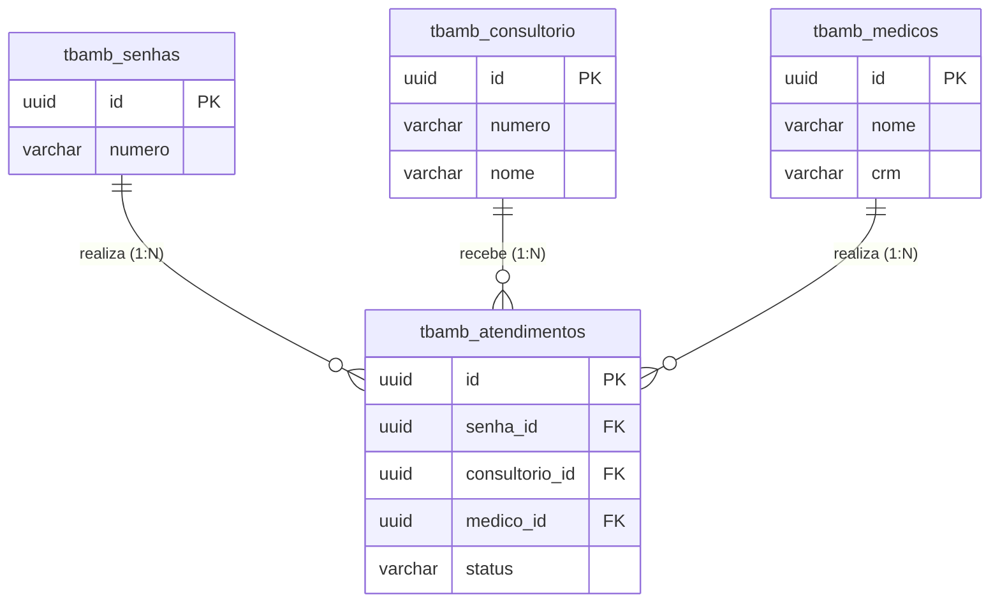
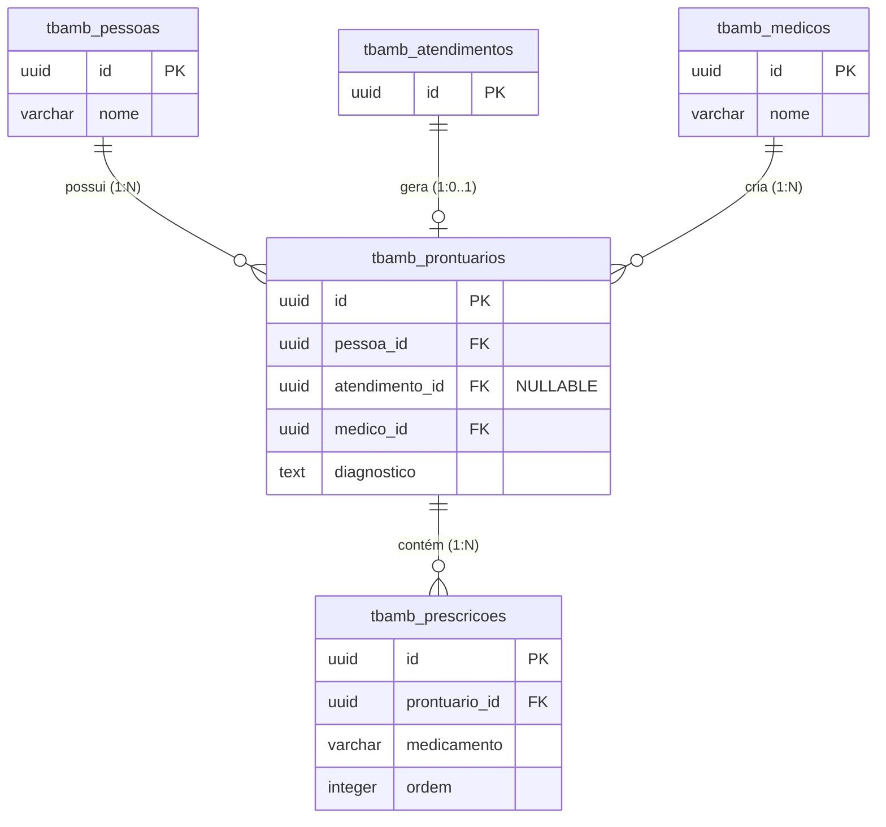

# Relacionamentos e Cardinalidade

## Índice

1. [Visão Geral dos Relacionamentos](#1-visão-geral-dos-relacionamentos)
2. [Relacionamentos Detalhados](#2-relacionamentos-detalhados)
3. [Diagramas de Relacionamento por Módulo](#3-diagramas-de-relacionamento-por-módulo)
4. [Regras de Integridade Referencial](#4-regras-de-integridade-referencial)
5. [Casos de Uso dos Relacionamentos](#5-casos-de-uso-dos-relacionamentos)

---

## 1. Visão Geral dos Relacionamentos

### Tabela de Relacionamentos

| # | Tabela Origem | Campo FK | Tabela Destino | Campo PK | Cardinalidade | Tipo | DELETE |
|---|--------------|----------|----------------|----------|---------------|------|--------|
| 1 | `tbamb_senhas` | `pessoa_id` | `tbamb_pessoas` | `id` | N:1 | Obrigatório | RESTRICT |
| 2 | `tbamb_triagem` | `senha_id` | `tbamb_senhas` | `id` | 1:1 | Obrigatório | RESTRICT |
| 3 | `tbamb_atendimentos` | `senha_id` | `tbamb_senhas` | `id` | N:1 | Obrigatório | RESTRICT |
| 4 | `tbamb_atendimentos` | `consultorio_id` | `tbamb_consultorio` | `id` | N:1 | Obrigatório | RESTRICT |
| 5 | `tbamb_atendimentos` | `medico_id` | `tbamb_medicos` | `id` | N:1 | Obrigatório | RESTRICT |
| 6 | `tbamb_chamadas` | `senha_id` | `tbamb_senhas` | `id` | N:1 | Obrigatório | RESTRICT |
| 7 | `tbamb_prontuarios` | `pessoa_id` | `tbamb_pessoas` | `id` | N:1 | Obrigatório | RESTRICT |
| 8 | `tbamb_prontuarios` | `atendimento_id` | `tbamb_atendimentos` | `id` | 1:1 | Opcional | RESTRICT |
| 9 | `tbamb_prontuarios` | `medico_id` | `tbamb_medicos` | `id` | N:1 | Obrigatório | RESTRICT |
| 10 | `tbamb_prescricoes` | `prontuario_id` | `tbamb_prontuarios` | `id` | N:1 | Obrigatório | CASCADE |

### Legenda de Cardinalidade

- **1:1** - Um para um (relacionamento único)
- **N:1** - Muitos para um (vários registros relacionados a um)
- **1:N** - Um para muitos (um registro pode ter vários relacionados)
- **N:M** - Muitos para muitos (requer tabela intermediária - não usado neste modelo)

### Legenda de DELETE Action

- **RESTRICT** - Impede exclusão se houver registros relacionados (preserva integridade)
- **CASCADE** - Exclui registros relacionados automaticamente
- **SET NULL** - Define FK como NULL quando registro pai é excluído (não usado neste modelo)

---

## 2. Relacionamentos Detalhados

### 2.1. tbamb_pessoas → tbamb_senhas (1:N)

**Descrição**: Uma pessoa pode gerar múltiplas senhas ao longo do tempo (histórico de atendimentos).

**Configuração**:
```sql
tbamb_senhas.pessoa_id → tbamb_pessoas.id (NOT NULL, ON DELETE RESTRICT)
```

**Cardinalidade**:
- **tbamb_pessoas**: 1 registro
- **tbamb_senhas**: 0 a N registros (0 = pessoa cadastrada mas nunca gerou senha)

**Regras de Negócio**:
- Uma pessoa deve existir antes de gerar uma senha
- Não é possível excluir uma pessoa que possui senhas registradas
- Todas as senhas de uma pessoa ficam vinculadas ao seu histórico

**Queries Comuns**:

```sql
-- Buscar todas as senhas de uma pessoa
SELECT s.*
FROM tbamb_senhas s
WHERE s.pessoa_id = '123e4567-e89b-12d3-a456-426614174000'
ORDER BY s.data_hora_geracao DESC;

-- Contar quantas senhas uma pessoa já gerou
SELECT p.nome, COUNT(s.id) as total_senhas
FROM tbamb_pessoas p
LEFT JOIN tbamb_senhas s ON s.pessoa_id = p.id
GROUP BY p.id, p.nome;
```

---

### 2.2. tbamb_senhas → tbamb_triagem (1:0..1)

**Descrição**: Uma senha pode ter zero ou um registro de triagem (relação opcional 1:1).

**Configuração**:
```sql
tbamb_triagem.senha_id → tbamb_senhas.id (UNIQUE, NOT NULL, ON DELETE RESTRICT)
```

**Cardinalidade**:
- **tbamb_senhas**: 1 registro
- **tbamb_triagem**: 0 ou 1 registro (0 = senha pulou triagem e foi direto para médico)

**Regras de Negócio**:
- Cada senha pode ter **no máximo** um registro de triagem
- Triagem é **opcional** no fluxo (casos de emergência podem pular)
- A constraint `UNIQUE` em `senha_id` garante a cardinalidade 1:1
- Não é possível excluir uma senha que possui triagem registrada

**Queries Comuns**:

```sql
-- Buscar triagem de uma senha específica
SELECT t.*
FROM tbamb_triagem t
WHERE t.senha_id = '123e4567-e89b-12d3-a456-426614174001';

-- Listar senhas que NÃO passaram por triagem
SELECT s.*
FROM tbamb_senhas s
LEFT JOIN tbamb_triagem t ON t.senha_id = s.id
WHERE t.id IS NULL
  AND s.status IN ('aguardando_medico', 'em_atendimento', 'concluido');

-- Listar senhas COM triagem completa
SELECT s.*, t.*
FROM tbamb_senhas s
INNER JOIN tbamb_triagem t ON t.senha_id = s.id
WHERE t.data_hora_fim IS NOT NULL;
```

---

### 2.3. tbamb_senhas → tbamb_atendimentos (1:N)

**Descrição**: Uma senha pode ter múltiplos atendimentos médicos (caso seja encaminhada para várias especialidades).

**Configuração**:
```sql
tbamb_atendimentos.senha_id → tbamb_senhas.id (NOT NULL, ON DELETE RESTRICT)
```

**Cardinalidade**:
- **tbamb_senhas**: 1 registro
- **tbamb_atendimentos**: 0 a N registros (0 = ainda aguardando, N = múltiplas consultas)

**Regras de Negócio**:
- Uma senha pode ter vários atendimentos (ex: Clínica Geral → Cardiologia)
- Atendimentos são sequenciais (um por vez)
- Não é possível excluir uma senha que possui atendimentos registrados

**Queries Comuns**:

```sql
-- Buscar todos os atendimentos de uma senha
SELECT a.*, c.nome as consultorio, m.nome as medico
FROM tbamb_atendimentos a
INNER JOIN tbamb_consultorio c ON c.id = a.consultorio_id
INNER JOIN tbamb_medicos m ON m.id = a.medico_id
WHERE a.senha_id = '123e4567-e89b-12d3-a456-426614174001'
ORDER BY a.data_hora_chamada;

-- Listar senhas com múltiplos atendimentos
SELECT s.numero, COUNT(a.id) as total_atendimentos
FROM tbamb_senhas s
INNER JOIN tbamb_atendimentos a ON a.senha_id = s.id
GROUP BY s.id, s.numero
HAVING COUNT(a.id) > 1;
```

---

### 2.4. tbamb_consultorio → tbamb_atendimentos (1:N)

**Descrição**: Um consultório pode receber múltiplos atendimentos ao longo do tempo.

**Configuração**:
```sql
tbamb_atendimentos.consultorio_id → tbamb_consultorio.id (NOT NULL, ON DELETE RESTRICT)
```

**Cardinalidade**:
- **tbamb_consultorio**: 1 registro
- **tbamb_atendimentos**: 0 a N registros

**Regras de Negócio**:
- Consultório deve estar cadastrado antes de receber atendimentos
- Não é possível excluir consultório que possui histórico de atendimentos
- Consultórios podem ser desativados (`ativo = FALSE`) sem excluir

**Queries Comuns**:

```sql
-- Listar atendimentos por consultório hoje
SELECT c.nome, COUNT(a.id) as total_atendimentos
FROM tbamb_consultorio c
LEFT JOIN tbamb_atendimentos a ON a.consultorio_id = c.id
  AND DATE(a.data_hora_chamada) = CURRENT_DATE
GROUP BY c.id, c.nome
ORDER BY c.numero;

-- Verificar se consultório está ocupado
SELECT c.nome, a.status, s.numero
FROM tbamb_consultorio c
LEFT JOIN tbamb_atendimentos a ON a.consultorio_id = c.id
  AND a.status = 'em_andamento'
LEFT JOIN tbamb_senhas s ON s.id = a.senha_id
WHERE c.id = '456e7890-e89b-12d3-a456-426614174010';
```

---

### 2.5. tbamb_medicos → tbamb_atendimentos (1:N)

**Descrição**: Um médico pode realizar múltiplos atendimentos.

**Configuração**:
```sql
tbamb_atendimentos.medico_id → tbamb_medicos.id (NOT NULL, ON DELETE RESTRICT)
```

**Cardinalidade**:
- **tbamb_medicos**: 1 registro
- **tbamb_atendimentos**: 0 a N registros

**Regras de Negócio**:
- Médico deve estar cadastrado antes de realizar atendimentos
- Não é possível excluir médico com histórico de atendimentos
- Médicos podem ser desativados (`ativo = FALSE`) sem excluir

**Queries Comuns**:

```sql
-- Listar atendimentos por médico hoje
SELECT m.nome, COUNT(a.id) as total_atendimentos
FROM tbamb_medicos m
LEFT JOIN tbamb_atendimentos a ON a.medico_id = m.id
  AND DATE(a.data_hora_chamada) = CURRENT_DATE
GROUP BY m.id, m.nome
ORDER BY total_atendimentos DESC;

-- Verificar se médico está atendendo
SELECT m.nome, a.status, s.numero, c.nome as consultorio
FROM tbamb_medicos m
LEFT JOIN tbamb_atendimentos a ON a.medico_id = m.id
  AND a.status = 'em_andamento'
LEFT JOIN tbamb_senhas s ON s.id = a.senha_id
LEFT JOIN tbamb_consultorio c ON c.id = a.consultorio_id
WHERE m.id = '789e0123-e89b-12d3-a456-426614174020';
```

---

### 2.6. tbamb_senhas → tbamb_chamadas (1:N)

**Descrição**: Uma senha pode ter múltiplas chamadas registradas (triagem + consultório(s)).

**Configuração**:
```sql
tbamb_chamadas.senha_id → tbamb_senhas.id (NOT NULL, ON DELETE RESTRICT)
```

**Cardinalidade**:
- **tbamb_senhas**: 1 registro
- **tbamb_chamadas**: 1 a N registros (mínimo 1 chamada para triagem ou consultório)

**Regras de Negócio**:
- Cada chamada (triagem ou consultório) gera um registro
- Tabela é **append-only** (apenas inserção, sem updates)
- Usado para exibição na TV e auditoria
- Campos desnormalizados para performance

**Queries Comuns**:

```sql
-- Últimas 6 chamadas para exibição na TV
SELECT *
FROM tbamb_chamadas
ORDER BY data_hora_chamada DESC
LIMIT 6;

-- Histórico de chamadas de uma senha
SELECT *
FROM tbamb_chamadas
WHERE senha_id = '123e4567-e89b-12d3-a456-426614174001'
ORDER BY data_hora_chamada;

-- Chamadas por tipo hoje
SELECT tipo_chamada, COUNT(*) as total
FROM tbamb_chamadas
WHERE DATE(data_hora_chamada) = CURRENT_DATE
GROUP BY tipo_chamada;
```

---

### 2.7. tbamb_pessoas → tbamb_prontuarios (1:N)

**Descrição**: Uma pessoa pode ter múltiplos prontuários ao longo do tempo (histórico médico).

**Configuração**:
```sql
tbamb_prontuarios.pessoa_id → tbamb_pessoas.id (NOT NULL, ON DELETE RESTRICT)
```

**Cardinalidade**:
- **tbamb_pessoas**: 1 registro
- **tbamb_prontuarios**: 0 a N registros

**Regras de Negócio**:
- Pessoa deve estar cadastrada antes de ter prontuário
- Não é possível excluir pessoa com prontuários
- Prontuários formam histórico médico completo

**Queries Comuns**:

```sql
-- Histórico de prontuários de uma pessoa
SELECT pr.*, m.nome as medico
FROM tbamb_prontuarios pr
INNER JOIN tbamb_medicos m ON m.id = pr.medico_id
WHERE pr.pessoa_id = '123e4567-e89b-12d3-a456-426614174000'
ORDER BY pr.data_atendimento DESC;

-- Último prontuário de uma pessoa
SELECT pr.*, m.nome as medico
FROM tbamb_prontuarios pr
INNER JOIN tbamb_medicos m ON m.id = pr.medico_id
WHERE pr.pessoa_id = '123e4567-e89b-12d3-a456-426614174000'
ORDER BY pr.data_atendimento DESC
LIMIT 1;
```

---

### 2.8. tbamb_atendimentos → tbamb_prontuarios (1:0..1)

**Descrição**: Um atendimento pode gerar zero ou um prontuário.

**Configuração**:
```sql
tbamb_prontuarios.atendimento_id → tbamb_atendimentos.id (NULLABLE, ON DELETE RESTRICT)
```

**Cardinalidade**:
- **tbamb_atendimentos**: 1 registro
- **tbamb_prontuarios**: 0 ou 1 registro

**Regras de Negócio**:
- Atendimento pode não gerar prontuário (ex: retorno rápido)
- Prontuários podem ser criados manualmente (sem `atendimento_id`)
- Vínculo é opcional mas quando existe é 1:1

**Queries Comuns**:

```sql
-- Atendimentos sem prontuário
SELECT a.*, s.numero, m.nome as medico
FROM tbamb_atendimentos a
INNER JOIN tbamb_senhas s ON s.id = a.senha_id
INNER JOIN tbamb_medicos m ON m.id = a.medico_id
LEFT JOIN tbamb_prontuarios pr ON pr.atendimento_id = a.id
WHERE a.status = 'concluido'
  AND pr.id IS NULL;

-- Prontuário de um atendimento específico
SELECT pr.*
FROM tbamb_prontuarios pr
WHERE pr.atendimento_id = '456e7890-e89b-12d3-a456-426614174030';
```

---

### 2.9. tbamb_medicos → tbamb_prontuarios (1:N)

**Descrição**: Um médico pode criar múltiplos prontuários.

**Configuração**:
```sql
tbamb_prontuarios.medico_id → tbamb_medicos.id (NOT NULL, ON DELETE RESTRICT)
```

**Cardinalidade**:
- **tbamb_medicos**: 1 registro
- **tbamb_prontuarios**: 0 a N registros

**Regras de Negócio**:
- Médico deve estar cadastrado antes de criar prontuários
- Não é possível excluir médico com histórico de prontuários
- Todos os prontuários mantêm vínculo com médico responsável

**Queries Comuns**:

```sql
-- Prontuários criados por um médico
SELECT pr.*, p.nome as paciente
FROM tbamb_prontuarios pr
INNER JOIN tbamb_pessoas p ON p.id = pr.pessoa_id
WHERE pr.medico_id = '789e0123-e89b-12d3-a456-426614174020'
ORDER BY pr.data_atendimento DESC;

-- Quantidade de prontuários por médico
SELECT m.nome, COUNT(pr.id) as total_prontuarios
FROM tbamb_medicos m
LEFT JOIN tbamb_prontuarios pr ON pr.medico_id = m.id
GROUP BY m.id, m.nome
ORDER BY total_prontuarios DESC;
```

---

### 2.10. tbamb_prontuarios → tbamb_prescricoes (1:N)

**Descrição**: Um prontuário pode ter múltiplas prescrições.

**Configuração**:
```sql
tbamb_prescricoes.prontuario_id → tbamb_prontuarios.id (NOT NULL, ON DELETE CASCADE)
```

**Cardinalidade**:
- **tbamb_prontuarios**: 1 registro
- **tbamb_prescricoes**: 0 a N registros

**Regras de Negócio**:
- Prontuário pode ter zero prescrições (sem medicação)
- Prescrições são ordenadas pelo campo `ordem`
- **DELETE CASCADE**: Ao excluir prontuário, prescrições são excluídas automaticamente
- Única relação do banco com CASCADE (prescrições são parte integral do prontuário)

**Queries Comuns**:

```sql
-- Prescrições de um prontuário
SELECT *
FROM tbamb_prescricoes
WHERE prontuario_id = '123e4567-e89b-12d3-a456-426614174040'
ORDER BY ordem;

-- Prontuários com prescrições
SELECT pr.*, COUNT(p.id) as total_medicamentos
FROM tbamb_prontuarios pr
LEFT JOIN tbamb_prescricoes p ON p.prontuario_id = pr.id
GROUP BY pr.id
HAVING COUNT(p.id) > 0;

-- Receita completa (para impressão)
SELECT
  pr.data_atendimento,
  m.nome as medico,
  m.crm,
  m.crm_uf,
  pe.nome as paciente,
  p.medicamento,
  p.dosagem,
  p.frequencia,
  p.duracao,
  p.instrucoes,
  p.ordem
FROM tbamb_prescricoes p
INNER JOIN tbamb_prontuarios pr ON pr.id = p.prontuario_id
INNER JOIN tbamb_medicos m ON m.id = pr.medico_id
INNER JOIN tbamb_pessoas pe ON pe.id = pr.pessoa_id
WHERE p.prontuario_id = '123e4567-e89b-12d3-a456-426614174040'
ORDER BY p.ordem;
```

---

## 3. Diagramas de Relacionamento por Módulo

### 3.1. Módulo de Fila (Geração de Senha)



### 3.2. Módulo de Triagem



### 3.3. Módulo de Atendimento Médico



### 3.4. Módulo de Prontuário



---

## 4. Regras de Integridade Referencial

### 4.1. ON DELETE RESTRICT (Padrão)

**Usado em**: Quase todos os relacionamentos

**Comportamento**: Impede exclusão do registro pai se houver registros filhos relacionados.

**Exemplo**:
```sql
-- Tentativa de excluir pessoa com senhas
DELETE FROM tbamb_pessoas WHERE id = '123...';
-- ❌ ERRO: violação de integridade referencial
-- Existem registros em tbamb_senhas que referenciam esta pessoa

-- Solução: excluir/mover senhas primeiro
DELETE FROM tbamb_senhas WHERE pessoa_id = '123...';
DELETE FROM tbamb_pessoas WHERE id = '123...';
-- ✅ OK
```

**Tabelas afetadas**:
- `tbamb_pessoas` (senhas e prontuários dependentes)
- `tbamb_senhas` (triagem, atendimentos e chamadas dependentes)
- `tbamb_consultorio` (atendimentos dependentes)
- `tbamb_medicos` (atendimentos e prontuários dependentes)
- `tbamb_atendimentos` (prontuários dependentes)

### 4.2. ON DELETE CASCADE

**Usado em**: Apenas `tbamb_prescricoes`

**Comportamento**: Ao excluir prontuário, prescrições são excluídas automaticamente.

**Exemplo**:
```sql
-- Excluir prontuário
DELETE FROM tbamb_prontuarios WHERE id = '123...';
-- ✅ OK: todas as prescrições vinculadas são excluídas automaticamente
-- Não é necessário excluir prescrições manualmente
```

**Justificativa**: Prescrições são parte integral do prontuário e não fazem sentido sem ele.

### 4.3. Soft Delete vs Hard Delete

**Tabelas com Soft Delete** (campo `ativo`):
- `tbamb_pessoas`
- `tbamb_consultorio`
- `tbamb_medicos`

**Uso**:
```sql
-- Soft delete (preferível)
UPDATE tbamb_medicos SET ativo = FALSE WHERE id = '123...';

-- Hard delete (evitar)
DELETE FROM tbamb_medicos WHERE id = '123...';
-- ❌ Pode falhar se houver atendimentos relacionados
```

**Vantagens do Soft Delete**:
- Preserva integridade referencial
- Mantém histórico
- Permite restauração
- Não quebra relatórios históricos

---

## 5. Casos de Uso dos Relacionamentos

### 5.1. Fluxo Completo de Atendimento

```sql
-- 1. Buscar dados da pessoa
SELECT * FROM tbamb_pessoas WHERE matricula_cracha = 'EMP001';

-- 2. Buscar senha ativa
SELECT s.*
FROM tbamb_senhas s
WHERE s.pessoa_id = '...'
  AND s.status NOT IN ('concluido', 'cancelado')
ORDER BY s.data_hora_geracao DESC
LIMIT 1;

-- 3. Verificar se passou por triagem
SELECT t.*
FROM tbamb_triagem t
WHERE t.senha_id = '...';

-- 4. Buscar atendimentos da senha
SELECT a.*, c.nome as consultorio, m.nome as medico
FROM tbamb_atendimentos a
INNER JOIN tbamb_consultorio c ON c.id = a.consultorio_id
INNER JOIN tbamb_medicos m ON m.id = a.medico_id
WHERE a.senha_id = '...';

-- 5. Buscar prontuário do atendimento
SELECT pr.*
FROM tbamb_prontuarios pr
WHERE pr.atendimento_id = '...';

-- 6. Buscar prescrições do prontuário
SELECT p.*
FROM tbamb_prescricoes p
WHERE p.prontuario_id = '...'
ORDER BY p.ordem;
```

### 5.2. Relatório de Atendimentos do Dia

```sql
SELECT
  s.numero as senha,
  p.nome as paciente,
  p.tipo_pessoa,
  t.atendente_triagem,
  t.data_hora_inicio as hora_triagem,
  c.nome as consultorio,
  m.nome as medico,
  a.data_hora_inicio as hora_atendimento,
  a.status,
  s.tempo_total_atendimento_min
FROM tbamb_senhas s
INNER JOIN tbamb_pessoas p ON p.id = s.pessoa_id
LEFT JOIN tbamb_triagem t ON t.senha_id = s.id
LEFT JOIN tbamb_atendimentos a ON a.senha_id = s.id
LEFT JOIN tbamb_consultorio c ON c.id = a.consultorio_id
LEFT JOIN tbamb_medicos m ON m.id = a.medico_id
WHERE DATE(s.data_hora_geracao) = CURRENT_DATE
ORDER BY s.data_hora_geracao;
```

### 5.3. Histórico Médico Completo de uma Pessoa

```sql
SELECT
  pr.data_atendimento,
  m.nome as medico,
  pr.queixa_principal,
  pr.diagnostico,
  pr.tratamento,
  STRING_AGG(
    p.medicamento || ' ' || p.dosagem || ' - ' || p.frequencia,
    ', '
  ) as medicamentos
FROM tbamb_prontuarios pr
INNER JOIN tbamb_medicos m ON m.id = pr.medico_id
LEFT JOIN tbamb_prescricoes p ON p.prontuario_id = pr.id
WHERE pr.pessoa_id = '123e4567-e89b-12d3-a456-426614174000'
GROUP BY pr.id, pr.data_atendimento, m.nome, pr.queixa_principal, pr.diagnostico, pr.tratamento
ORDER BY pr.data_atendimento DESC;
```

### 5.4. Status de Consultórios em Tempo Real

```sql
SELECT
  c.numero,
  c.nome,
  c.especialidade,
  CASE
    WHEN a.id IS NULL THEN 'Livre'
    ELSE 'Ocupado'
  END as status,
  s.numero as senha_atual,
  m.nome as medico_atual,
  a.data_hora_inicio
FROM tbamb_consultorio c
LEFT JOIN tbamb_atendimentos a ON a.consultorio_id = c.id
  AND a.status = 'em_andamento'
LEFT JOIN tbamb_senhas s ON s.id = a.senha_id
LEFT JOIN tbamb_medicos m ON m.id = a.medico_id
WHERE c.ativo = TRUE
ORDER BY c.numero;
```

### 5.5. Fila de Espera Consolidada

```sql
-- Senhas aguardando triagem
SELECT
  'TRIAGEM' as etapa,
  s.numero,
  s.tipo,
  p.nome,
  s.data_hora_geracao,
  EXTRACT(EPOCH FROM (NOW() - s.data_hora_geracao)) / 60 as minutos_aguardando
FROM tbamb_senhas s
INNER JOIN tbamb_pessoas p ON p.id = s.pessoa_id
WHERE s.status = 'aguardando'
ORDER BY
  CASE WHEN s.tipo = 'prioritaria' THEN 0 ELSE 1 END,
  s.data_hora_geracao

UNION ALL

-- Senhas aguardando médico
SELECT
  'MÉDICO' as etapa,
  s.numero,
  s.tipo,
  p.nome,
  s.data_hora_fim_triagem as data_hora_geracao,
  EXTRACT(EPOCH FROM (NOW() - s.data_hora_fim_triagem)) / 60 as minutos_aguardando
FROM tbamb_senhas s
INNER JOIN tbamb_pessoas p ON p.id = s.pessoa_id
WHERE s.status = 'aguardando_medico'
ORDER BY
  CASE WHEN s.tipo = 'prioritaria' THEN 0 ELSE 1 END,
  s.data_hora_fim_triagem;
```

---

## Observações Finais

### Integridade do Banco

- Todas as Foreign Keys possuem índices automáticos para performance
- Constraints garantem consistência dos dados
- Triggers calculam campos derivados automaticamente
- Soft delete preserva histórico e integridade

### Performance

- Índices em todas as Foreign Keys
- Índices compostos em queries frequentes (`status + tipo`)
- Desnormalização estratégica em `tbamb_chamadas` para TV

### Manutenção

- DELETE RESTRICT evita exclusões acidentais
- Campos `created_at` e `updated_at` facilitam auditoria
- Relacionamentos bem definidos facilitam refatoração

### Extensibilidade

- Estrutura permite adição de novos consultórios e médicos
- Suporta múltiplos atendimentos por senha (encaminhamentos)
- Prontuários independentes permitem registros manuais
- Prescrições podem ser expandidas com mais campos
