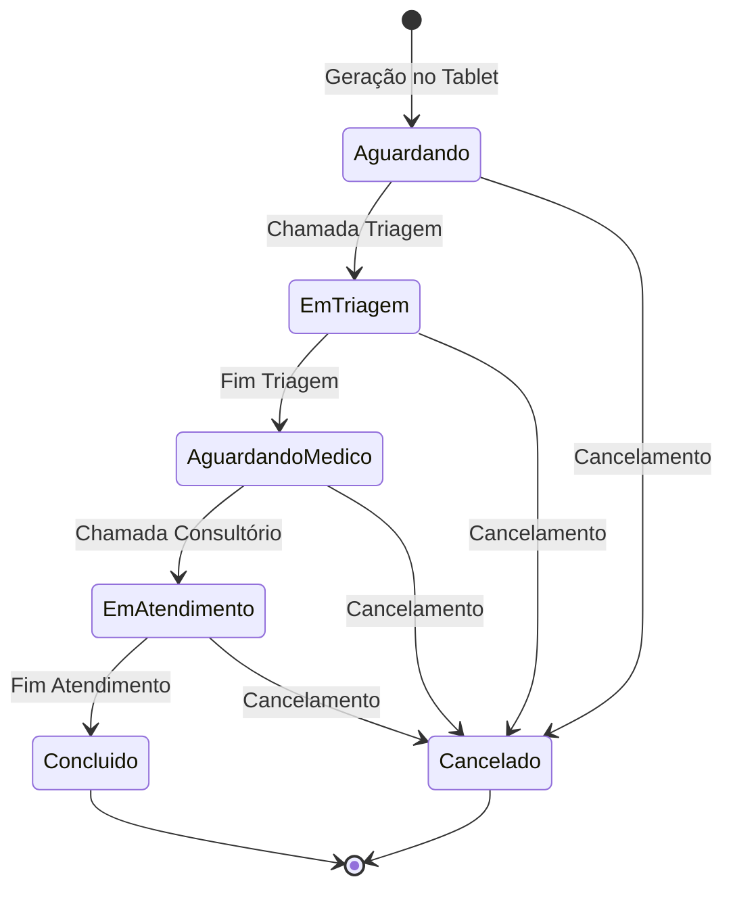
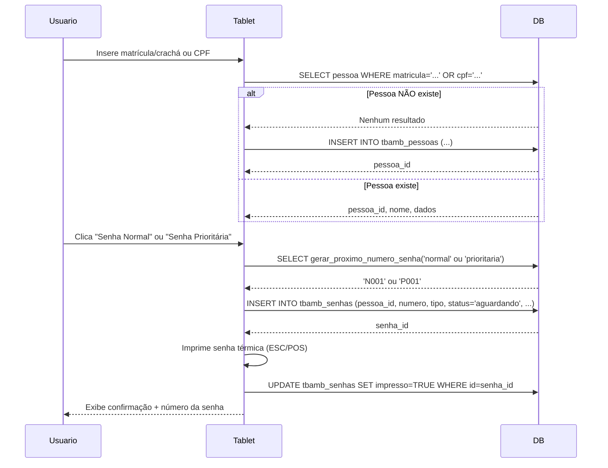
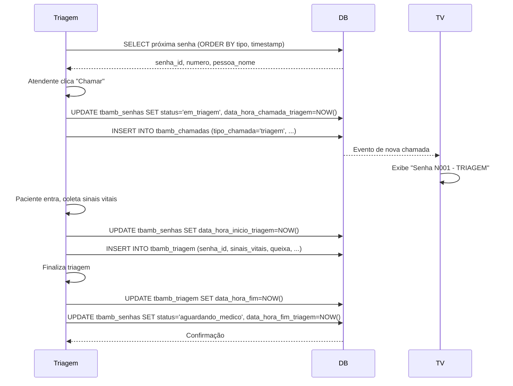
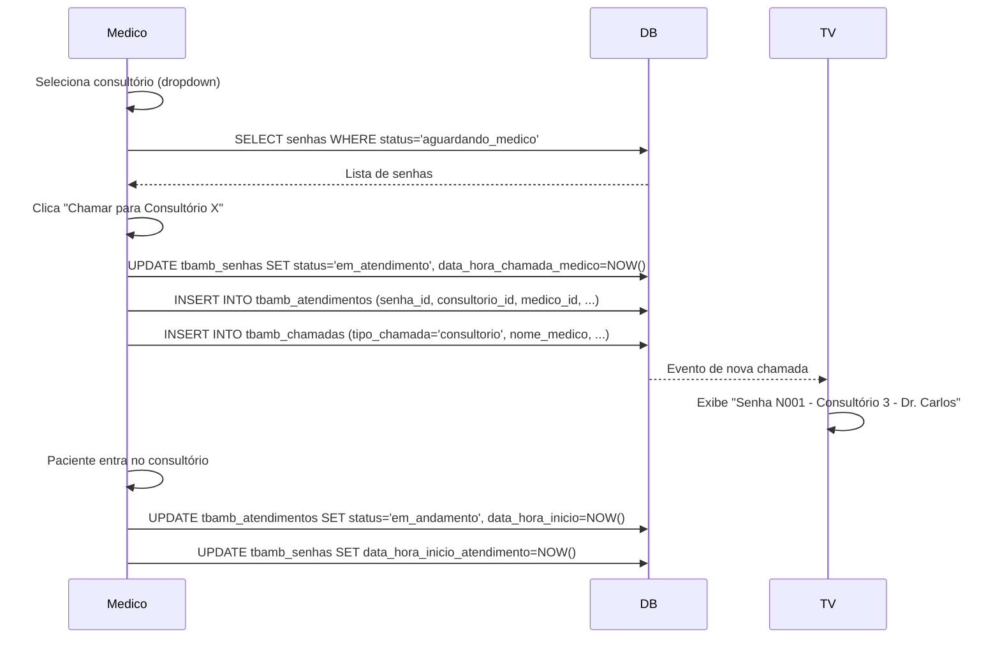
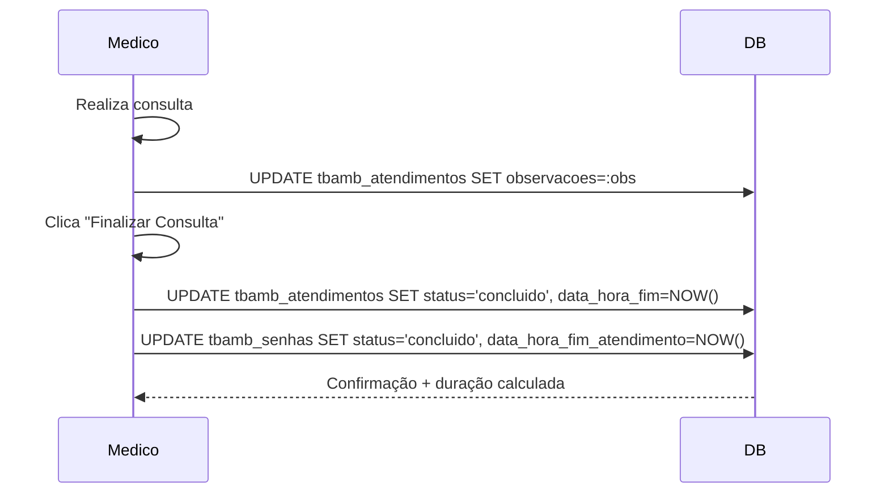
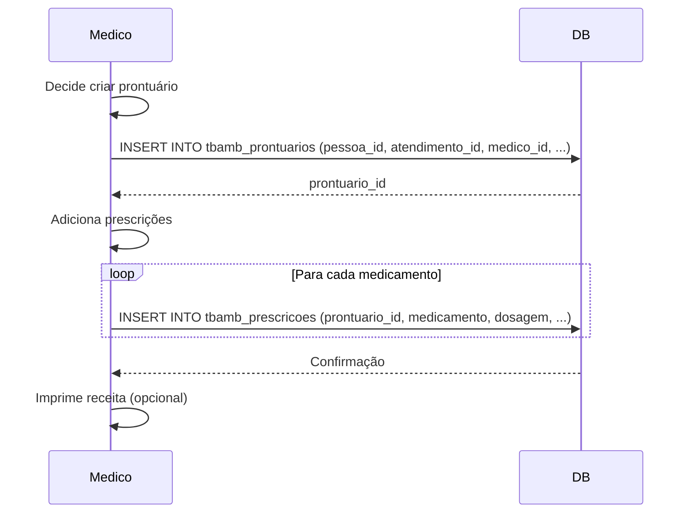
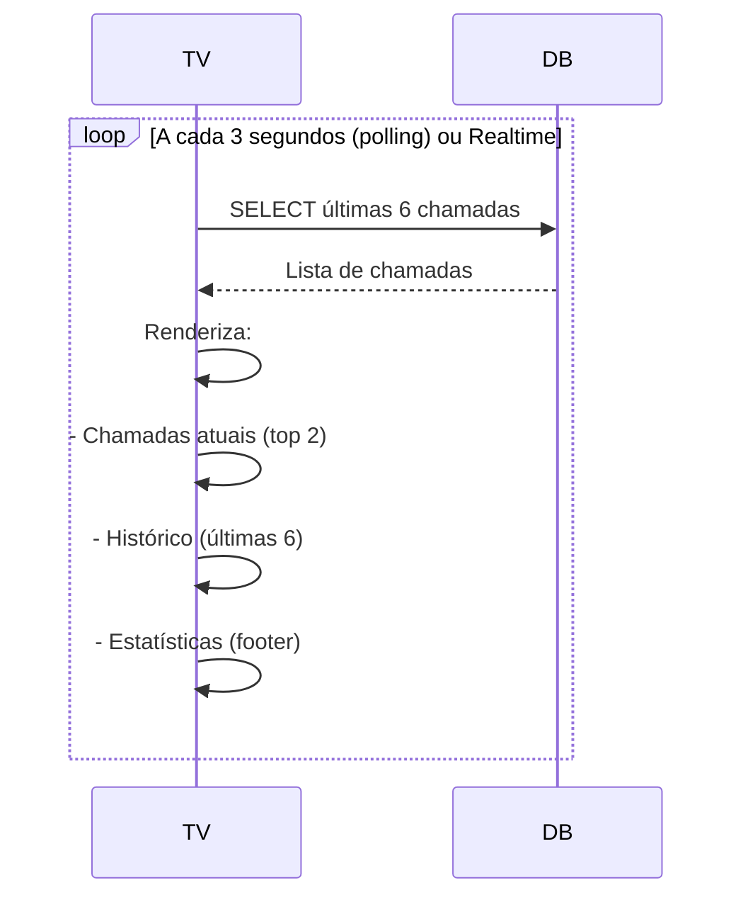
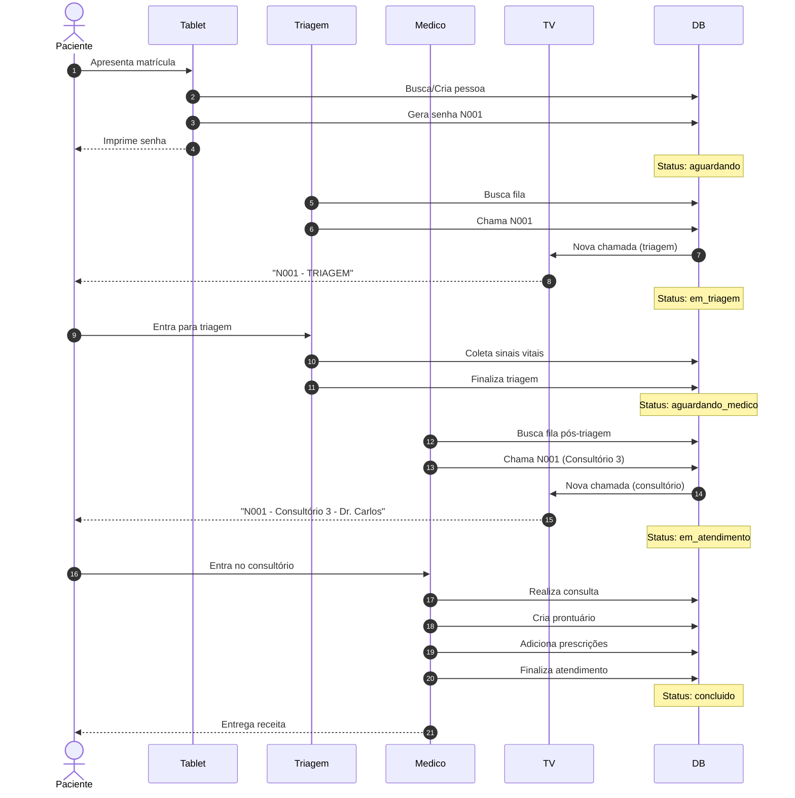
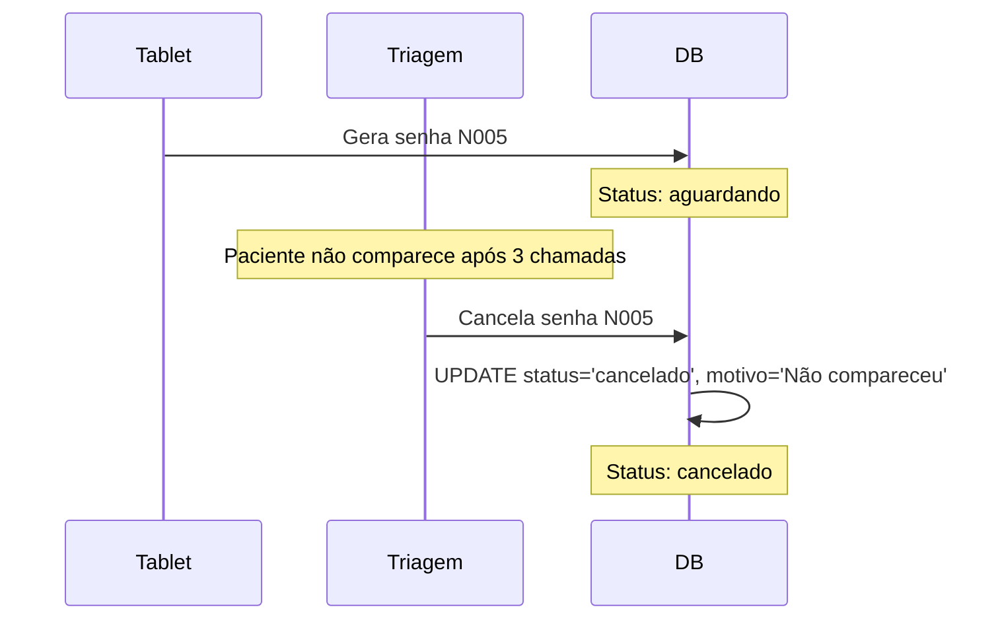

# Fluxo de Dados entre Etapas do Atendimento

## Índice

1. [Visão Geral do Fluxo](#1-visão-geral-do-fluxo)
2. [Etapa 1: Geração de Senha (Tablet)](#2-etapa-1-geração-de-senha-tablet)
3. [Etapa 2: Chamada e Triagem](#3-etapa-2-chamada-e-triagem)
4. [Etapa 3: Chamada para Consultório Médico](#4-etapa-3-chamada-para-consultório-médico)
5. [Etapa 4: Atendimento Médico](#5-etapa-4-atendimento-médico)
6. [Etapa 5: Finalização e Prontuário](#6-etapa-5-finalização-e-prontuário)
7. [Exibição na TV](#7-exibição-na-tv)
8. [Queries de Integração](#8-queries-de-integração)
9. [Diagramas de Sequência](#9-diagramas-de-sequência)

---

## 1. Visão Geral do Fluxo

### Diagrama de Estados da Senha



### Timeline Completa

```
TABLET          TRIAGEM         MÉDICO          PRONTUÁRIO
   |                |               |                 |
   | Gera Senha     |               |                 |
   |--------------->|               |                 |
   | (aguardando)   |               |                 |
   |                |               |                 |
   |                | Chama         |                 |
   |                |-------------->|                 |
   |                | (em_triagem)  |                 |
   |                |               |                 |
   |                | Finaliza      |                 |
   |                |-------------->|                 |
   |                | (aguardando_  |                 |
   |                |  medico)      |                 |
   |                |               |                 |
   |                |               | Chama           |
   |                |               |---------------->|
   |                |               | (em_atendimento)|
   |                |               |                 |
   |                |               | Finaliza        |
   |                |               |---------------->|
   |                |               | (concluido)     | Cria Prontuário
   |                |               |                 |---------------->
   |                |               |                 | (concluido)
```

### Tabelas Afetadas por Etapa

| Etapa | Tabelas Modificadas | Tabelas Consultadas |
|-------|---------------------|---------------------|
| Geração | `tbamb_senhas` (INSERT) | `tbamb_pessoas` (SELECT) |
| Chamada Triagem | `tbamb_senhas` (UPDATE)<br>`tbamb_chamadas` (INSERT) | `tbamb_senhas` (SELECT) |
| Realização Triagem | `tbamb_triagem` (INSERT)<br>`tbamb_senhas` (UPDATE) | `tbamb_senhas` (SELECT) |
| Chamada Médico | `tbamb_senhas` (UPDATE)<br>`tbamb_atendimentos` (INSERT)<br>`tbamb_chamadas` (INSERT) | `tbamb_senhas` (SELECT)<br>`tbamb_consultorio` (SELECT)<br>`tbamb_medicos` (SELECT) |
| Atendimento | `tbamb_atendimentos` (UPDATE)<br>`tbamb_senhas` (UPDATE) | `tbamb_atendimentos` (SELECT) |
| Finalização | `tbamb_atendimentos` (UPDATE)<br>`tbamb_senhas` (UPDATE)<br>`tbamb_prontuarios` (INSERT)<br>`tbamb_prescricoes` (INSERT) | `tbamb_atendimentos` (SELECT)<br>`tbamb_pessoas` (SELECT) |

---

## 2. Etapa 1: Geração de Senha (Tablet)

### Descrição

O operador do tablet identifica o paciente (colaborador ou visitante) e gera uma senha normal ou prioritária.

### Fluxo de Dados



### SQL de Integração

#### 1. Buscar ou Criar Pessoa (Colaborador)

```sql
-- Buscar colaborador
SELECT id, nome, tipo_pessoa
FROM tbamb_pessoas
WHERE matricula_cracha = :matricula
  AND ativo = TRUE;

-- Se não encontrar, criar
INSERT INTO tbamb_pessoas (
  tipo_pessoa, matricula_cracha, nome, ativo
)
VALUES (
  'colaborador',
  :matricula,
  :nome,
  TRUE
)
RETURNING id, nome;
```

#### 2. Buscar ou Criar Pessoa (Visitante)

```sql
-- Buscar visitante
SELECT id, nome, tipo_pessoa
FROM tbamb_pessoas
WHERE cpf = :cpf
  AND ativo = TRUE;

-- Se não encontrar, criar
INSERT INTO tbamb_pessoas (
  tipo_pessoa, cpf, nome, telefone, ativo
)
VALUES (
  'visitante',
  :cpf,
  :nome,
  :telefone,
  TRUE
)
RETURNING id, nome;
```

#### 3. Gerar Próximo Número de Senha

```sql
-- Usar função do banco
SELECT gerar_proximo_numero_senha(:tipo); -- 'normal' ou 'prioritaria'
-- Retorna: 'N001', 'N002', 'P001', etc.
```

#### 4. Criar Senha

```sql
INSERT INTO tbamb_senhas (
  pessoa_id,
  numero,
  tipo,
  status,
  data_hora_geracao,
  tablet_gerador,
  impresso
)
VALUES (
  :pessoa_id,
  :numero,               -- 'N001' ou 'P001'
  :tipo,                 -- 'normal' ou 'prioritaria'
  'aguardando',          -- Status inicial
  NOW(),
  :tablet_id,            -- 'TABLET-001'
  FALSE                  -- Será TRUE após impressão
)
RETURNING id, numero;
```

#### 5. Confirmar Impressão

```sql
UPDATE tbamb_senhas
SET impresso = TRUE
WHERE id = :senha_id;
```

### Dados de Saída

- `senha_id`: UUID da senha criada
- `numero`: Número da senha (ex: "N001")
- `pessoa_nome`: Nome do paciente
- `tipo`: Tipo da senha (normal/prioritaria)

---

## 3. Etapa 2: Chamada e Triagem

### Descrição

A triagem chama o próximo paciente da fila (priorizando senhas prioritárias) e realiza a avaliação inicial.

### Fluxo de Dados



### SQL de Integração

#### 1. Buscar Próxima Senha da Fila

```sql
-- Buscar próxima senha aguardando triagem
SELECT
  s.id,
  s.numero,
  s.tipo,
  s.data_hora_geracao,
  p.nome as pessoa_nome,
  p.tipo_pessoa,
  p.matricula_cracha,
  EXTRACT(EPOCH FROM (NOW() - s.data_hora_geracao)) / 60 as minutos_aguardando
FROM tbamb_senhas s
INNER JOIN tbamb_pessoas p ON p.id = s.pessoa_id
WHERE s.status = 'aguardando'
ORDER BY
  CASE WHEN s.tipo = 'prioritaria' THEN 0 ELSE 1 END,  -- Prioridade primeiro
  s.data_hora_geracao                                   -- Depois FIFO
LIMIT 1;
```

#### 2. Chamar Senha para Triagem

```sql
-- Atualizar status da senha
UPDATE tbamb_senhas
SET
  status = 'em_triagem',
  data_hora_chamada_triagem = NOW(),
  updated_at = NOW()
WHERE id = :senha_id
RETURNING numero, tipo;

-- Registrar chamada para TV
INSERT INTO tbamb_chamadas (
  senha_id,
  tipo_chamada,
  numero_senha,
  tipo_senha,
  local_chamada,
  data_hora_chamada
)
VALUES (
  :senha_id,
  'triagem',
  :numero,              -- 'N001'
  :tipo,                -- 'normal' ou 'prioritaria'
  'Triagem',            -- Ou 'Triagem 1', 'Triagem 2'
  NOW()
)
RETURNING id;
```

#### 3. Iniciar Triagem (Paciente Entrou)

```sql
-- Atualizar timestamp de início
UPDATE tbamb_senhas
SET data_hora_inicio_triagem = NOW()
WHERE id = :senha_id;

-- Criar registro de triagem
INSERT INTO tbamb_triagem (
  senha_id,
  atendente_triagem,
  sala_triagem,
  data_hora_inicio
)
VALUES (
  :senha_id,
  :atendente,            -- 'Enfermeira Ana'
  :sala,                 -- 'Triagem 1'
  NOW()
)
RETURNING id;
```

#### 4. Registrar Dados da Triagem

```sql
UPDATE tbamb_triagem
SET
  pressao_arterial = :pressao,          -- '120/80 mmHg'
  frequencia_cardiaca = :fc,            -- '72 bpm'
  temperatura = :temp,                  -- '36.5°C'
  frequencia_respiratoria = :fr,        -- '16 irpm'
  saturacao_oxigenio = :spo2,           -- '98%'
  peso = :peso,                         -- '70 kg'
  altura = :altura,                     -- '170 cm'
  queixa_principal = :queixa,
  prioridade_atribuida = :prioridade,   -- 'media'
  observacoes = :observacoes
WHERE senha_id = :senha_id;
```

#### 5. Finalizar Triagem

```sql
-- Atualizar fim da triagem
UPDATE tbamb_triagem
SET data_hora_fim = NOW()
WHERE senha_id = :senha_id;

-- Mudar status da senha
UPDATE tbamb_senhas
SET
  status = 'aguardando_medico',
  data_hora_fim_triagem = NOW()
WHERE id = :senha_id;
```

### Dados de Saída

- Senha movida de `aguardando` para `aguardando_medico`
- Registro completo em `tbamb_triagem`
- Nova chamada em `tbamb_chamadas` (visível na TV)
- Tempos calculados automaticamente via trigger

---

## 4. Etapa 3: Chamada para Consultório Médico

### Descrição

O médico seleciona um consultório e chama o próximo paciente da fila pós-triagem.

### Fluxo de Dados



### SQL de Integração

#### 1. Buscar Senhas Aguardando Médico

```sql
SELECT
  s.id,
  s.numero,
  s.tipo,
  s.data_hora_fim_triagem,
  p.nome as pessoa_nome,
  p.tipo_pessoa,
  t.queixa_principal,
  t.prioridade_atribuida,
  EXTRACT(EPOCH FROM (NOW() - s.data_hora_fim_triagem)) / 60 as minutos_aguardando
FROM tbamb_senhas s
INNER JOIN tbamb_pessoas p ON p.id = s.pessoa_id
LEFT JOIN tbamb_triagem t ON t.senha_id = s.id
WHERE s.status = 'aguardando_medico'
ORDER BY
  CASE WHEN s.tipo = 'prioritaria' THEN 0 ELSE 1 END,
  CASE WHEN t.prioridade_atribuida = 'urgente' THEN 0
       WHEN t.prioridade_atribuida = 'alta' THEN 1
       WHEN t.prioridade_atribuida = 'media' THEN 2
       ELSE 3 END,
  s.data_hora_fim_triagem;
```

#### 2. Buscar Consultórios Disponíveis

```sql
SELECT
  c.id,
  c.numero,
  c.nome,
  c.especialidade,
  CASE
    WHEN a.id IS NULL THEN 'Livre'
    ELSE 'Ocupado'
  END as status,
  s.numero as senha_ocupando
FROM tbamb_consultorio c
LEFT JOIN tbamb_atendimentos a ON a.consultorio_id = c.id
  AND a.status = 'em_andamento'
LEFT JOIN tbamb_senhas s ON s.id = a.senha_id
WHERE c.ativo = TRUE
ORDER BY c.numero;
```

#### 3. Chamar Senha para Consultório

```sql
-- Atualizar status da senha
UPDATE tbamb_senhas
SET
  status = 'em_atendimento',
  data_hora_chamada_medico = NOW()
WHERE id = :senha_id;

-- Criar registro de atendimento
INSERT INTO tbamb_atendimentos (
  senha_id,
  consultorio_id,
  medico_id,
  data_hora_chamada,
  status
)
VALUES (
  :senha_id,
  :consultorio_id,
  :medico_id,
  NOW(),
  'aguardando'           -- Paciente ainda não entrou
)
RETURNING id;

-- Registrar chamada para TV
INSERT INTO tbamb_chamadas (
  senha_id,
  tipo_chamada,
  numero_senha,
  tipo_senha,
  local_chamada,
  nome_medico,
  data_hora_chamada
)
SELECT
  :senha_id,
  'consultorio',
  s.numero,
  s.tipo,
  c.nome,               -- 'Consultório 3'
  m.nome,               -- 'Dr. Carlos Alberto Silva'
  NOW()
FROM tbamb_senhas s
CROSS JOIN tbamb_consultorio c
CROSS JOIN tbamb_medicos m
WHERE s.id = :senha_id
  AND c.id = :consultorio_id
  AND m.id = :medico_id;
```

#### 4. Iniciar Atendimento (Paciente Entrou)

```sql
-- Atualizar atendimento
UPDATE tbamb_atendimentos
SET
  status = 'em_andamento',
  data_hora_inicio = NOW()
WHERE id = :atendimento_id;

-- Atualizar senha
UPDATE tbamb_senhas
SET data_hora_inicio_atendimento = NOW()
WHERE id = :senha_id;
```

### Dados de Saída

- Senha em `em_atendimento`
- Novo registro em `tbamb_atendimentos`
- Nova chamada em `tbamb_chamadas` (visível na TV com médico e consultório)

---

## 5. Etapa 4: Atendimento Médico

### Descrição

O médico realiza a consulta, registra observações e finaliza o atendimento.

### Fluxo de Dados



### SQL de Integração

#### 1. Buscar Atendimento em Andamento

```sql
SELECT
  a.id as atendimento_id,
  s.id as senha_id,
  s.numero,
  p.nome as paciente_nome,
  p.tipo_pessoa,
  p.matricula_cracha,
  p.cpf,
  c.nome as consultorio,
  m.nome as medico,
  t.queixa_principal,
  t.pressao_arterial,
  t.frequencia_cardiaca,
  t.temperatura,
  a.data_hora_inicio,
  EXTRACT(EPOCH FROM (NOW() - a.data_hora_inicio)) / 60 as duracao_minutos
FROM tbamb_atendimentos a
INNER JOIN tbamb_senhas s ON s.id = a.senha_id
INNER JOIN tbamb_pessoas p ON p.id = s.pessoa_id
INNER JOIN tbamb_consultorio c ON c.id = a.consultorio_id
INNER JOIN tbamb_medicos m ON m.id = a.medico_id
LEFT JOIN tbamb_triagem t ON t.senha_id = s.id
WHERE a.status = 'em_andamento'
  AND a.medico_id = :medico_id;  -- Filtrar pelo médico logado
```

#### 2. Atualizar Observações Durante Consulta

```sql
UPDATE tbamb_atendimentos
SET
  observacoes = :observacoes,
  updated_at = NOW()
WHERE id = :atendimento_id;
```

#### 3. Finalizar Atendimento

```sql
-- Finalizar atendimento
UPDATE tbamb_atendimentos
SET
  status = 'concluido',
  data_hora_fim = NOW()
WHERE id = :atendimento_id
RETURNING duracao_minutos;  -- Calculado automaticamente via trigger

-- Finalizar senha
UPDATE tbamb_senhas
SET
  status = 'concluido',
  data_hora_fim_atendimento = NOW()
WHERE id = :senha_id
RETURNING tempo_total_atendimento_min;  -- Calculado via trigger
```

---

## 6. Etapa 5: Finalização e Prontuário

### Descrição

Opcionalmente, o médico pode criar um prontuário eletrônico detalhado com prescrições.

### Fluxo de Dados



### SQL de Integração

#### 1. Criar Prontuário

```sql
INSERT INTO tbamb_prontuarios (
  pessoa_id,
  atendimento_id,
  medico_id,
  data_atendimento,
  queixa_principal,
  historia_doenca_atual,
  antecedentes_pessoais,
  antecedentes_familiares,
  medicacoes_em_uso,
  alergias,
  historia_social,
  exame_fisico,
  diagnostico,
  tratamento,
  acompanhamento,
  observacoes
)
SELECT
  s.pessoa_id,
  :atendimento_id,
  :medico_id,
  CURRENT_DATE,
  :queixa_principal,
  :historia_doenca_atual,
  :antecedentes_pessoais,
  :antecedentes_familiares,
  :medicacoes_em_uso,
  :alergias,
  :historia_social,
  :exame_fisico,
  :diagnostico,
  :tratamento,
  :acompanhamento,
  :observacoes
FROM tbamb_atendimentos a
INNER JOIN tbamb_senhas s ON s.id = a.senha_id
WHERE a.id = :atendimento_id
RETURNING id;
```

#### 2. Adicionar Prescrições

```sql
-- Inserir múltiplas prescrições
INSERT INTO tbamb_prescricoes (
  prontuario_id,
  medicamento,
  dosagem,
  frequencia,
  duracao,
  instrucoes,
  ordem
)
VALUES
  (:prontuario_id, 'Dipirona', '500mg', '6/6h', '3 dias', 'Tomar com água', 1),
  (:prontuario_id, 'Omeprazol', '20mg', '1x/dia', '7 dias', 'Em jejum', 2);
```

#### 3. Buscar Prontuário para Impressão

```sql
SELECT
  -- Dados do prontuário
  pr.data_atendimento,
  pr.queixa_principal,
  pr.diagnostico,
  pr.tratamento,

  -- Dados do paciente
  p.nome as paciente_nome,
  p.cpf,
  p.data_nascimento,

  -- Dados do médico
  m.nome as medico_nome,
  m.crm,
  m.crm_uf,
  m.especialidade,

  -- Prescrições (agregadas)
  JSON_AGG(
    JSON_BUILD_OBJECT(
      'medicamento', psc.medicamento,
      'dosagem', psc.dosagem,
      'frequencia', psc.frequencia,
      'duracao', psc.duracao,
      'instrucoes', psc.instrucoes,
      'ordem', psc.ordem
    ) ORDER BY psc.ordem
  ) as prescricoes

FROM tbamb_prontuarios pr
INNER JOIN tbamb_pessoas p ON p.id = pr.pessoa_id
INNER JOIN tbamb_medicos m ON m.id = pr.medico_id
LEFT JOIN tbamb_prescricoes psc ON psc.prontuario_id = pr.id
WHERE pr.id = :prontuario_id
GROUP BY pr.id, p.id, m.id;
```

---

## 7. Exibição na TV

### Descrição

A tela de TV exibe as últimas chamadas em tempo real (tanto triagem quanto consultórios).

### Fluxo de Dados



### SQL de Integração

#### 1. Buscar Últimas Chamadas

```sql
-- Últimas 6 chamadas (para TV)
SELECT
  id,
  tipo_chamada,
  numero_senha,
  tipo_senha,
  local_chamada,
  nome_medico,
  data_hora_chamada,
  CASE
    WHEN tipo_chamada = 'triagem' THEN local_chamada
    ELSE local_chamada || ' - ' || nome_medico
  END as chamada_completa
FROM tbamb_chamadas
ORDER BY data_hora_chamada DESC
LIMIT 6;
```

#### 2. Buscar Estatísticas em Tempo Real

```sql
SELECT
  -- Total de senhas hoje
  COUNT(*) as total_hoje,

  -- Fila normal aguardando
  COUNT(*) FILTER (WHERE tipo = 'normal' AND status = 'aguardando') as fila_normal,

  -- Fila prioritária aguardando
  COUNT(*) FILTER (WHERE tipo = 'prioritaria' AND status = 'aguardando') as fila_prioritaria,

  -- Total aguardando (triagem ou médico)
  COUNT(*) FILTER (WHERE status IN ('aguardando', 'aguardando_medico')) as total_aguardando,

  -- Em atendimento
  COUNT(*) FILTER (WHERE status IN ('em_triagem', 'em_atendimento')) as em_atendimento,

  -- Concluídos
  COUNT(*) FILTER (WHERE status = 'concluido') as concluidos,

  -- Tempo médio de espera
  ROUND(AVG(tempo_total_atendimento_min)) as tempo_medio_total

FROM tbamb_senhas
WHERE DATE(data_hora_geracao) = CURRENT_DATE;
```

#### 3. Subscription Realtime (Supabase)

```typescript
// JavaScript/TypeScript - Supabase Realtime
const subscription = supabase
  .channel('chamadas')
  .on(
    'postgres_changes',
    {
      event: 'INSERT',
      schema: 'public',
      table: 'tbamb_chamadas'
    },
    (payload) => {
      // Nova chamada inserida
      const novaChamada = payload.new;
      atualizarTV(novaChamada);
    }
  )
  .subscribe();
```

---

## 8. Queries de Integração

### 8.1. Dashboard - Relatório do Dia

```sql
SELECT
  -- Contadores
  COUNT(*) as total_senhas,
  COUNT(*) FILTER (WHERE tipo = 'normal') as total_normal,
  COUNT(*) FILTER (WHERE tipo = 'prioritaria') as total_prioritaria,
  COUNT(*) FILTER (WHERE status = 'concluido') as total_concluidos,
  COUNT(*) FILTER (WHERE status = 'cancelado') as total_cancelados,

  -- Tempos médios
  ROUND(AVG(tempo_espera_triagem_min)) as tempo_medio_triagem,
  ROUND(AVG(tempo_espera_medico_min)) as tempo_medio_medico,
  ROUND(AVG(tempo_total_atendimento_min)) as tempo_medio_total,

  -- Distribuição por hora
  JSON_AGG(
    JSON_BUILD_OBJECT(
      'hora', EXTRACT(HOUR FROM data_hora_geracao),
      'quantidade', COUNT(*)
    )
  ) as distribuicao_hora

FROM tbamb_senhas
WHERE DATE(data_hora_geracao) = CURRENT_DATE
GROUP BY DATE(data_hora_geracao);
```

### 8.2. Buscar Histórico Completo de uma Senha

```sql
SELECT
  -- Dados da senha
  s.numero,
  s.tipo,
  s.status,

  -- Dados da pessoa
  p.nome as paciente,
  p.tipo_pessoa,
  p.matricula_cracha,

  -- Timestamps
  s.data_hora_geracao,
  s.data_hora_chamada_triagem,
  s.data_hora_inicio_triagem,
  s.data_hora_fim_triagem,
  s.data_hora_chamada_medico,
  s.data_hora_inicio_atendimento,
  s.data_hora_fim_atendimento,

  -- Tempos calculados
  s.tempo_espera_triagem_min,
  s.tempo_espera_medico_min,
  s.tempo_total_atendimento_min,

  -- Dados da triagem
  t.atendente_triagem,
  t.pressao_arterial,
  t.queixa_principal,
  t.prioridade_atribuida,

  -- Dados do atendimento
  c.nome as consultorio,
  m.nome as medico,
  a.duracao_minutos,
  a.observacoes,

  -- Prontuário
  pr.id as prontuario_id,
  pr.diagnostico

FROM tbamb_senhas s
INNER JOIN tbamb_pessoas p ON p.id = s.pessoa_id
LEFT JOIN tbamb_triagem t ON t.senha_id = s.id
LEFT JOIN tbamb_atendimentos a ON a.senha_id = s.id
LEFT JOIN tbamb_consultorio c ON c.id = a.consultorio_id
LEFT JOIN tbamb_medicos m ON m.id = a.medico_id
LEFT JOIN tbamb_prontuarios pr ON pr.atendimento_id = a.id
WHERE s.numero = :numero
  AND DATE(s.data_hora_geracao) = CURRENT_DATE;
```

### 8.3. Monitorar Performance em Tempo Real

```sql
-- Senhas atrasadas (mais de 30 min aguardando)
SELECT
  s.numero,
  s.tipo,
  s.status,
  p.nome,
  ROUND(EXTRACT(EPOCH FROM (NOW() - COALESCE(s.data_hora_fim_triagem, s.data_hora_geracao))) / 60) as minutos_aguardando
FROM tbamb_senhas s
INNER JOIN tbamb_pessoas p ON p.id = s.pessoa_id
WHERE s.status IN ('aguardando', 'aguardando_medico')
  AND (NOW() - COALESCE(s.data_hora_fim_triagem, s.data_hora_geracao)) > INTERVAL '30 minutes'
ORDER BY minutos_aguardando DESC;
```

---

## 9. Diagramas de Sequência

### 9.1. Fluxo Completo (Happy Path)



### 9.2. Fluxo com Cancelamento



---

## Observações Finais

### Características do Fluxo

1. **Estados bem definidos**: Cada etapa tem status claro na tabela `tbamb_senhas`
2. **Rastreabilidade total**: Todos os timestamps são registrados
3. **Cálculos automáticos**: Triggers calculam tempos de espera
4. **Exibição em tempo real**: TV atualizada via `tbamb_chamadas`
5. **Flexibilidade**: Suporta múltiplos atendimentos por senha
6. **Auditoria**: Histórico completo preservado

### Integrações Necessárias

- **Frontend React** ↔ **Supabase**: Queries SQL via cliente JavaScript
- **TV (polling ou realtime)** ↔ **Supabase**: Subscription em `tbamb_chamadas`
- **Impressora térmica** ↔ **Android**: Intent para RawBT (ESC/POS)

### Performance

- Índices em todos os campos de status e timestamps
- Queries otimizadas com LIMIT e ORDER BY
- Desnormalização em `tbamb_chamadas` evita joins na TV
- Triggers mantêm dados calculados atualizados

### Próximos Passos

1. Implementar RLS (Row Level Security) no Supabase
2. Criar views materializadas para dashboard
3. Implementar notificações push para médicos
4. Adicionar sistema de priorização dinâmica
