# Diagrama Entidade-Relacionamento (ER)

## Visão Geral

Este diagrama representa a estrutura completa do banco de dados do sistema SICFAR-Clinic, modelado para suportar o fluxo ambulatorial desde a geração de senha até a finalização do atendimento médico.

O sistema integra-se com as tabelas existentes `tbfuncionario` (sistema de RH) e `tbvisitante` (controle de acesso), utilizando **duas Foreign Keys opcionais** em `tbamb_senhas`.

---

## Diagrama ER Completo (Mermaid)

```mermaid
erDiagram
    tbfuncionario ||--o{ tbamb_senhas : "gera"
    tbvisitante ||--o{ tbamb_senhas : "gera"
    tbamb_senhas ||--o| tbamb_triagem : "passa por"
    tbamb_senhas ||--o{ tbamb_atendimentos : "realiza"
    tbamb_senhas ||--o{ tbamb_chamadas : "registra"
    tbamb_consultorio ||--o{ tbamb_atendimentos : "recebe"
    tbamb_medicos ||--o{ tbamb_atendimentos : "realiza"
    tbfuncionario ||--o{ tbamb_prontuarios : "possui"
    tbvisitante ||--o{ tbamb_prontuarios : "possui"
    tbamb_prontuarios ||--o{ tbamb_prescricoes : "contém"
    tbamb_atendimentos ||--o| tbamb_prontuarios : "gera"

    tbfuncionario {
        bigint id PK "Identificador único (BIGSERIAL)"
        varchar emp_codigo "Código da empresa"
        varchar epg_codigo "Código EPG (Fortes AC)"
        varchar nome "Nome completo"
        varchar cpf "CPF do funcionário"
        date dt_nascimento "Data de nascimento"
        varchar email "Email"
        varchar celular "Celular"
        bytea foto "Foto do funcionário"
        timestamptz created_at "Data de criação"
        timestamptz updated_at "Data de atualização"
    }

    tbvisitante {
        bigint visitante_id PK "Identificador único (BIGSERIAL)"
        varchar nome "Nome completo"
        varchar doc_tipo "Tipo de documento (CPF, RG, CNH)"
        varchar doc_numero "Número do documento"
        varchar celular "Celular"
        varchar empresa "Empresa do visitante"
        varchar contato_interno "Funcionário que autorizou"
        bytea foto "Foto do visitante"
        char deletado "Soft delete (N=ativo, S=deletado)"
        timestamptz created_at "Data de criação"
        timestamptz updated_at "Data de atualização"
    }

    tbamb_senhas {
        uuid id PK "Identificador único"
        bigint funcionario_id FK "Referência a tbfuncionario (NULL se visitante)"
        bigint visitante_id FK "Referência a tbvisitante (NULL se funcionário)"
        varchar tipo_pessoa "funcionario | visitante"
        varchar numero "Número da senha (N001, P001)"
        varchar tipo "normal | prioritaria"
        varchar status "aguardando | em_triagem | aguardando_medico | em_atendimento | concluido | cancelado"
        timestamp data_hora_geracao "Data/hora de geração"
        timestamp data_hora_chamada_triagem "Data/hora chamada para triagem"
        timestamp data_hora_inicio_triagem "Data/hora início triagem"
        timestamp data_hora_fim_triagem "Data/hora fim triagem"
        timestamp data_hora_chamada_medico "Data/hora chamada para médico"
        timestamp data_hora_inicio_atendimento "Data/hora início atendimento médico"
        timestamp data_hora_fim_atendimento "Data/hora fim atendimento"
        timestamp data_hora_cancelamento "Data/hora cancelamento"
        varchar motivo_cancelamento "Motivo do cancelamento"
        integer tempo_espera_triagem_min "Tempo de espera para triagem (minutos)"
        integer tempo_espera_medico_min "Tempo de espera para médico (minutos)"
        integer tempo_total_atendimento_min "Tempo total do atendimento (minutos)"
        varchar tablet_gerador "Identificador do tablet que gerou"
        boolean impresso "Senha foi impressa"
        timestamp created_at "Data de criação"
        timestamp updated_at "Data de atualização"
    }

    tbamb_triagem {
        uuid id PK "Identificador único"
        uuid senha_id FK "Referência à senha (UNIQUE 1:1)"
        varchar atendente_triagem "Nome do atendente de triagem"
        varchar sala_triagem "Sala de triagem (Triagem 1, Triagem 2)"
        text observacoes "Observações da triagem"
        varchar pressao_arterial "PA (120/80 mmHg)"
        varchar frequencia_cardiaca "FC (72 bpm)"
        varchar temperatura "Temperatura (36.5°C)"
        varchar frequencia_respiratoria "FR (16 irpm)"
        varchar saturacao_oxigenio "SpO2 (98%)"
        varchar peso "Peso (70 kg)"
        varchar altura "Altura (170 cm)"
        text queixa_principal "Queixa principal relatada"
        varchar prioridade_atribuida "baixa | media | alta | urgente"
        timestamp data_hora_inicio "Data/hora início triagem"
        timestamp data_hora_fim "Data/hora fim triagem"
        timestamp created_at "Data de criação"
        timestamp updated_at "Data de atualização"
    }

    tbamb_consultorio {
        uuid id PK "Identificador único"
        varchar numero "Número do consultório (1, 2, 3, 4, 5)"
        varchar nome "Nome do consultório (Consultório 1)"
        varchar localizacao "Localização física (Ala A, Sala 101)"
        varchar especialidade "Especialidade (Clínica Geral, Cardiologia)"
        boolean ativo "Consultório ativo"
        timestamp created_at "Data de criação"
        timestamp updated_at "Data de atualização"
    }

    tbamb_medicos {
        uuid id PK "Identificador único"
        varchar nome "Nome completo do médico"
        varchar crm "Número CRM"
        varchar crm_uf "UF do CRM"
        varchar especialidade "Especialidade médica"
        varchar telefone "Telefone de contato"
        varchar email "Email"
        boolean ativo "Médico ativo"
        timestamp created_at "Data de criação"
        timestamp updated_at "Data de atualização"
    }

    tbamb_atendimentos {
        uuid id PK "Identificador único"
        uuid senha_id FK "Referência à senha"
        uuid consultorio_id FK "Referência ao consultório"
        uuid medico_id FK "Referência ao médico"
        timestamp data_hora_chamada "Data/hora da chamada"
        timestamp data_hora_inicio "Data/hora início atendimento"
        timestamp data_hora_fim "Data/hora fim atendimento"
        integer duracao_minutos "Duração em minutos"
        text observacoes "Observações do atendimento"
        varchar status "aguardando | em_andamento | concluido | cancelado"
        timestamp created_at "Data de criação"
        timestamp updated_at "Data de atualização"
    }

    tbamb_chamadas {
        uuid id PK "Identificador único"
        uuid senha_id FK "Referência à senha"
        varchar tipo_chamada "triagem | consultorio"
        varchar numero_senha "Número da senha (N001, P001)"
        varchar tipo_senha "normal | prioritaria"
        varchar local_chamada "Local da chamada (Triagem, Consultório 1)"
        varchar nome_medico "Nome do médico (se aplicável)"
        timestamp data_hora_chamada "Data/hora da chamada"
        boolean exibido_tv "Foi exibido na TV"
        timestamp created_at "Data de criação"
    }

    tbamb_prontuarios {
        uuid id PK "Identificador único"
        bigint funcionario_id FK "Referência a tbfuncionario (NULL se visitante)"
        bigint visitante_id FK "Referência a tbvisitante (NULL se funcionário)"
        varchar tipo_pessoa "funcionario | visitante"
        uuid atendimento_id FK "Referência ao atendimento (opcional)"
        uuid medico_id FK "Referência ao médico"
        date data_atendimento "Data do atendimento"
        text queixa_principal "Queixa principal"
        text historia_doenca_atual "HDA"
        text antecedentes_pessoais "Antecedentes pessoais"
        text antecedentes_familiares "Antecedentes familiares"
        text medicacoes_em_uso "Medicações em uso"
        text alergias "Alergias"
        text historia_social "História social"
        text exame_fisico "Exame físico detalhado"
        text diagnostico "Diagnóstico"
        text tratamento "Plano terapêutico"
        text acompanhamento "Orientações de acompanhamento"
        text observacoes "Observações gerais"
        timestamp created_at "Data de criação"
        timestamp updated_at "Data de atualização"
    }

    tbamb_prescricoes {
        uuid id PK "Identificador único"
        uuid prontuario_id FK "Referência ao prontuário"
        varchar medicamento "Nome do medicamento"
        varchar dosagem "Dosagem (500mg)"
        varchar frequencia "Frequência (8/8h)"
        varchar duracao "Duração (7 dias)"
        text instrucoes "Instruções de uso"
        integer ordem "Ordem na prescrição"
        timestamp created_at "Data de criação"
    }
```



---

## Diagrama Simplificado (Módulos)

### Módulo de Identificação (Tabelas Existentes)

```
┌─────────────────┐          ┌─────────────────┐
│ tbfuncionario   │          │  tbvisitante    │
├─────────────────┤          ├─────────────────┤
│ id (PK)         │          │ visitante_id(PK)│
│ emp_codigo      │          │ nome            │
│ epg_codigo      │          │ doc_tipo        │
│ nome            │          │ doc_numero      │
│ cpf             │          │ celular         │
│ ...             │          │ deletado        │
└────────┬────────┘          └────────┬────────┘
         │                            │
         │  1:N                       │ 1:N
         │                            │
         ▼                            ▼
         └─────────┬──────────────────┘
                   │
             ┌─────▼───────┐
             │tbamb_senhas │
             │(Eixo Central)│
             └─────────────┘
```

---

## Legenda

- **PK**: Primary Key (Chave Primária)
- **FK**: Foreign Key (Chave Estrangeira)
- **UK**: Unique Key (Chave Única)
- **||--o{**: Um para muitos (1:N)
- **||--o|**: Um para zero ou um (1:0..1)

---

## Cores e Categorias

As tabelas podem ser organizadas nas seguintes categorias funcionais:

### 🟦 Módulo de Cadastro e Identificação (Tabelas Existentes)
- `tbfuncionario` - Cadastro de funcionários (Sistema RH - Fortes AC)
- `tbvisitante` - Cadastro de visitantes externos

### 🟩 Módulo de Fila e Senhas
- `tbamb_senhas` - Controle de senhas geradas (**eixo central**)
- `tbamb_chamadas` - Histórico de chamadas para TV

### 🟨 Módulo de Triagem
- `tbamb_triagem` - Dados da triagem inicial

### 🟧 Módulo de Atendimento Médico
- `tbamb_consultorio` - Cadastro de consultórios
- `tbamb_medicos` - Cadastro de médicos
- `tbamb_atendimentos` - Registro de atendimentos

### 🟥 Módulo de Prontuário
- `tbamb_prontuarios` - Prontuários eletrônicos
- `tbamb_prescricoes` - Prescrições médicas

---

## Observações de Design

### 1. **Integração com Tabelas Existentes**

O sistema **não cria** uma nova tabela de pessoas. Em vez disso, utiliza as tabelas já existentes:
- **`tbfuncionario`**: Gerida pelo sistema de RH (Fortes AC/EPG)
- **`tbvisitante`**: Gerida pelo sistema de controle de acesso

### 2. **Estratégia de Foreign Keys: Duas FKs Opcionais**

`tbamb_senhas` e `tbamb_prontuarios` possuem **duas FKs opcionais** (uma será NULL):

```sql
-- Constraint: apenas UMA FK pode estar preenchida
CONSTRAINT chk_pessoa_exclusiva
  CHECK (
    (funcionario_id IS NOT NULL AND visitante_id IS NULL) OR
    (funcionario_id IS NULL AND visitante_id IS NOT NULL)
  )
```

**Vantagens**:
- ✅ Preserva integridade referencial
- ✅ Não duplica dados de pessoas
- ✅ Usa tabelas já existentes do sistema
- ✅ Permite queries polimórficas com `COALESCE`

**Exemplo de uso**:
```sql
SELECT
  s.*,
  COALESCE(f.nome, v.nome) as pessoa_nome,
  s.tipo_pessoa
FROM tbamb_senhas s
LEFT JOIN tbfuncionario f ON f.id = s.funcionario_id
LEFT JOIN tbvisitante v ON v.visitante_id = s.visitante_id;
```

### 3. **Rastreabilidade Completa**

A tabela `tbamb_senhas` funciona como **eixo central**, registrando todos os timestamps de cada etapa do fluxo:
- Geração → Chamada Triagem → Início Triagem → Fim Triagem
- Chamada Médico → Início Atendimento → Fim Atendimento

### 4. **Auditoria**

- **tbfuncionario**: `created_at`, `updated_at`
- **tbvisitante**: Auditoria completa (inclusão, alteração, exclusão) + soft delete
- **Tabelas ambulatoriais**: `created_at`, `updated_at`

### 5. **Performance**

- Índices em todas as FKs (`funcionario_id`, `visitante_id`)
- Índices compostos para queries frequentes
- Desnormalização controlada em `tbamb_chamadas` (TV)

### 6. **Histórico de Chamadas**

`tbamb_chamadas` mantém registro independente (append-only) para:
- Exibição na TV em tempo real
- Auditoria de chamadas
- Relatórios de atividade

### 7. **Normalização**

- **Sem duplicação**: Dados de pessoas permanecem nas tabelas originais
- **Sem redundância**: Apenas FKs e campos essenciais em `tbamb_senhas`
- **Integridade**: Constraints garantem consistência

### 8. **Soft Delete**

- **tbvisitante**: Campo `deletado` ('N' ou 'S')
- **tbfuncionario**: Não possui soft delete (gerido pelo RH)
- **Tabelas ambulatoriais**: Sem soft delete (usa status e cancelamento)

---

## Diferenças de Tipo de Dados

| Tabela | PK Tipo | Observação |
|--------|---------|-----------|
| `tbfuncionario` | **BIGINT** | Sistema RH (BIGSERIAL) |
| `tbvisitante` | **BIGINT** | Convertido de Firebird (BIGSERIAL) |
| `tbamb_*` (novas) | **UUID** | Sistema ambulatorial (uuid_generate_v4()) |

**Razão**: As tabelas existentes usam BIGSERIAL (sistema legado), enquanto as novas tabelas ambulatoriais usam UUID para melhor distribuição e segurança.

---

## Constraint de Exclusividade

### tbamb_senhas

```sql
CONSTRAINT chk_senha_pessoa_exclusiva
  CHECK (
    (funcionario_id IS NOT NULL AND visitante_id IS NULL) OR
    (funcionario_id IS NULL AND visitante_id IS NOT NULL)
  )
```

### tbamb_prontuarios

```sql
CONSTRAINT chk_prontuario_pessoa_exclusiva
  CHECK (
    (funcionario_id IS NOT NULL AND visitante_id IS NULL) OR
    (funcionario_id IS NULL AND visitante_id IS NOT NULL)
  )
```

Estas constraints garantem que **apenas uma FK esteja preenchida**, evitando inconsistências.

---

## Resumo de Relacionamentos

| Origem | Destino | Cardinalidade | Descrição |
|--------|---------|---------------|-----------|
| `tbfuncionario` | `tbamb_senhas` | 1:N | Funcionário pode gerar várias senhas |
| `tbvisitante` | `tbamb_senhas` | 1:N | Visitante pode gerar várias senhas |
| `tbamb_senhas` | `tbamb_triagem` | 1:0..1 | Senha pode ter zero ou uma triagem |
| `tbamb_senhas` | `tbamb_atendimentos` | 1:N | Senha pode ter vários atendimentos |
| `tbamb_senhas` | `tbamb_chamadas` | 1:N | Senha pode ter várias chamadas |
| `tbamb_consultorio` | `tbamb_atendimentos` | 1:N | Consultório recebe vários atendimentos |
| `tbamb_medicos` | `tbamb_atendimentos` | 1:N | Médico realiza vários atendimentos |
| `tbfuncionario` | `tbamb_prontuarios` | 1:N | Funcionário pode ter vários prontuários |
| `tbvisitante` | `tbamb_prontuarios` | 1:N | Visitante pode ter vários prontuários |
| `tbamb_atendimentos` | `tbamb_prontuarios` | 1:0..1 | Atendimento pode gerar zero ou um prontuário |
| `tbamb_medicos` | `tbamb_prontuarios` | 1:N | Médico cria vários prontuários |
| `tbamb_prontuarios` | `tbamb_prescricoes` | 1:N | Prontuário pode ter várias prescrições |

---

## Próximos Passos

1. ✅ Criar tabelas ambulatoriais (`tbamb_*`)
2. ✅ Definir constraints de exclusividade
3. ✅ Criar índices nas FKs
4. 🔜 Implementar triggers de cálculo de tempos
5. 🔜 Implementar Row Level Security (RLS)
6. 🔜 Criar view consolidada de pessoas (se necessário)

---

**Documentação atualizada para integração com tbfuncionario e tbvisitante**
📅 Janeiro 2025 | 🔄 Sem duplicação de dados de pessoas
